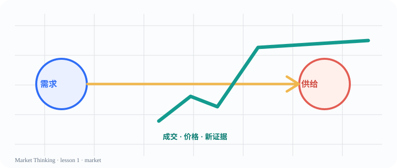

# 第1课：市场不是赌场，也不是答案机器

> 课程位置：导论 / 为什么学习市场思维 / 导论：为什么学习市场思维

## 本课目标
把市场从会涨会跌的屏幕，换成一间可以观察人类选择的实验室。

## Price Action 核心
价格是成交留下的行为记录；先描述价格走过的路线，再讨论它可能意味着什么。

> 市场不会替我们做决定；它只会不断给出新证据。

## 主图

## 三层案例
### 生活：奶茶店排队
同一杯奶茶在放学后和周一上午的价格、等待时间、受欢迎程度都可能不同。

### 历史：郁金香泡沫
当“大家都在买”变成最强理由时，价格会暂时脱离人们真正能承受的价值。

### 市场：一根急涨K线
上涨说明成交发生在更高价格，不自动说明未来一定继续上涨。

## 开放思考题
如果你只看到价格上涨，却不知道为什么上涨，你会把它当作答案、线索，还是警报？为什么？

## AI 一起讨论
请 AI 分别扮演支持者和怀疑者：一方解释为什么上涨可能延续，另一方列出至少三个替代解释。

## 复盘卡
- 我看见的事实：
- 我的主要解释：
- 支持证据：
- 反面证据：
- 什么会证明我错：
- 我现在愿意等待的新信息：

## 参考资料
- CME Group Technical Analysis
- Al Brooks Price Action books（重新组织，不照搬）
