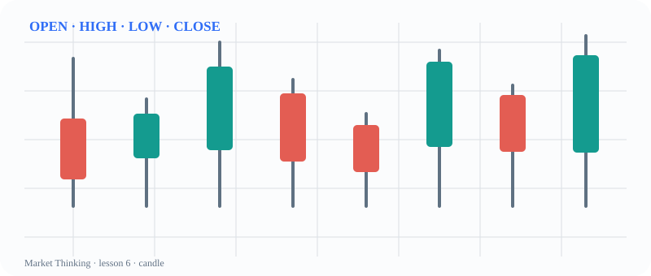

# 第6课：竞价与拍卖

> 课程位置：第一部分 / 认识价格与图表 / 第一单元：价格是如何形成的

## 本课目标
围绕《竞价与拍卖》建立一套可观察、可解释、可更新的判断框架。本课是课程初稿，后续会继续补充案例、图表和教师提示。

## 核心知识
本课属于 price-action 主题。学习时先把概念放回上下文：价格在哪里？参与者可能看见什么？什么证据支持当前解释？什么证据会让解释失效？

## 主图

## 三层案例
生活案例：把《价格运动》换成可观察的日常过程，例如排队、比赛比分、爬楼梯或一次试行方案。先写事实，再写你认为它可能意味着什么。

历史案例：选择一段当时信息不完整的转折。不要用后来知道的结果替代当时的证据，比较不同参与者可能看到的路径。

市场案例：回到图表，标出位置、结构、跟进和失败信号。相同形态放在不同上下文中，含义可以完全不同。

## 开放思考题
如果没有唯一答案，你会用哪些证据支持你对《竞价与拍卖》的解释？请同时写出一个反例和一个可能改变观点的新信息。

## AI 一起讨论
请 AI 先复述《竞价与拍卖》的问题，再提出三个不同情景；要求它标注证据、假设和无法确认的部分。

## 复盘卡
- 我看见的事实：
- 我的解释：
- 支持证据：
- 反面证据：
- 失效条件：
- 下一步观察：

## 参考资料
- Al Brooks Price Action 书籍与视频课程：仅作专业参考，不照搬原书。
- `sources/image-credits.md`：公开图像许可和权威教学页面。
