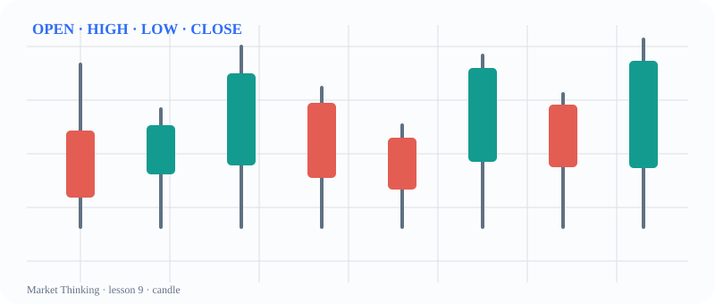
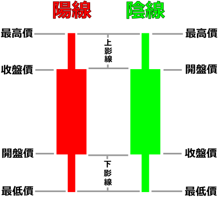

# 第9课：一根K线的四个价格

> 课程位置：第一部分 / 认识价格与图表 / 第二单元：认识K线

## 本课目标
把一根K线读成一段价格在这段时间里走过的路线，而不是红绿颜色。

## Price Action 核心
开盘、最高、最低、收盘共同构成实体和影线；收盘位置提供阶段性的多空信息。

> 一根K线不是信号按钮，而是一段多空拉扯被压缩后的记录。

## 主图

## 三层案例
### 生活：一场篮球进攻
开局、最高领先、最低落后和结束比分，合起来才知道这一回合发生过什么。

### 历史：一天的新闻窗口
收盘像一个阶段性总结，但它省略了当天许多来回变化。

### 市场：四个价格
实体与影线不是预测，而是帮助我们看见这段价格运动的结构。

## 开放思考题
如果两根K线收盘价一样，但其中一根影线很长，你会认为它们表达了同样的力量吗？

## AI 一起讨论
让 AI 用不超过 80 字描述一根K线，再检查它有没有把颜色当成结论。

## 复盘卡
- 我看见的事实：
- 我的主要解释：
- 支持证据：
- 反面证据：
- 什么会证明我错：
- 我现在愿意等待的新信息：

## 参考资料
- CME Group Chart Types: candlestick, line, bar
- Wikimedia Commons Candlestick.svg
- 许可参考图：`../../assets/reference/candlestick.svg`，详见 `sources/image-credits.md`。
