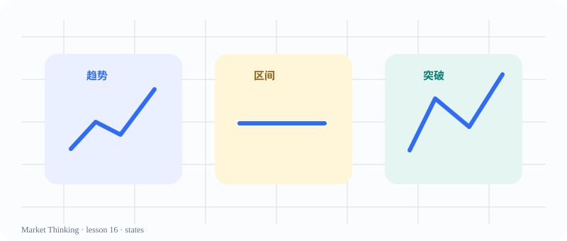

# 第16课：趋势、震荡与突破

> 课程位置：第二部分 / Price Action 的核心语言 / 第三单元：市场的三种基本状态

## 本课目标
先判断市场正在趋势、震荡，还是从一种状态转换到另一种状态。

## Price Action 核心
同一根大K线，在趋势里可能是跟进；在区间边缘也可能只是一次失败尝试。

> 上下文比形态名称更重要。市场状态是工作假设，不是永久标签。

## 主图

## 三层案例
### 生活：地铁客流
持续向一个方向移动像趋势；来回换乘、反复回到原站像区间。

### 历史：技术扩散
新技术会经历出现、加速、普及、饱和；状态变了，原判断也要更新。

### 市场：趋势 / 区间 / 突破
先标结构，再观察突破有没有跟进，不要用一个标签解释整张图。

## 开放思考题
一张图里同时出现小趋势和大区间时，你会选哪个标签？还需要知道什么？

## AI 一起讨论
让 AI 给同一张图写出趋势解释、区间解释和不明确解释，再比较各自的证据。

## 复盘卡
- 我看见的事实：
- 我的主要解释：
- 支持证据：
- 反面证据：
- 什么会证明我错：
- 我现在愿意等待的新信息：

## 参考资料
- Al Brooks Trading Price Action Trends
- CME Group Trend and Continuation Patterns
