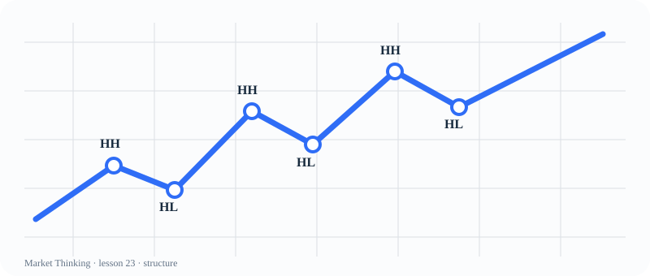

# 第23课：HH、HL、LH、LL

> 课程位置：第二部分 / Price Action 的核心语言 / 第四单元：趋势结构

## 本课目标
用 HH / HL / LH / LL 描述结构，不用“感觉很强”代替观察。

## Price Action 核心
趋势不是一条直线，而是推进、回调、再推进的结构序列。

> 结构破坏先意味着原假设受损，不等于马上反转。

## 主图

## 三层案例
### 生活：爬楼梯
每次爬高后稍微停一下，只要新的平台和低点不断抬高，整体仍在上行。

### 历史：城市成长
一次停滞不等于长期趋势结束，要观察下一次增长是否创出新高。

### 市场：更高高点与更高低点
HH + HL 是多头结构语言；LH + LL 是空头结构语言。

## 开放思考题
只破坏了一个 HL，你会立刻把趋势改成空头吗？列出至少两个替代解释。

## AI 一起讨论
让 AI 先只标 HH、HL、LH、LL，再让它说明哪个标记最不确定。

## 复盘卡
- 我看见的事实：
- 我的主要解释：
- 支持证据：
- 反面证据：
- 什么会证明我错：
- 我现在愿意等待的新信息：

## 参考资料
- Al Brooks Price Action framework
- 课程原创结构图
