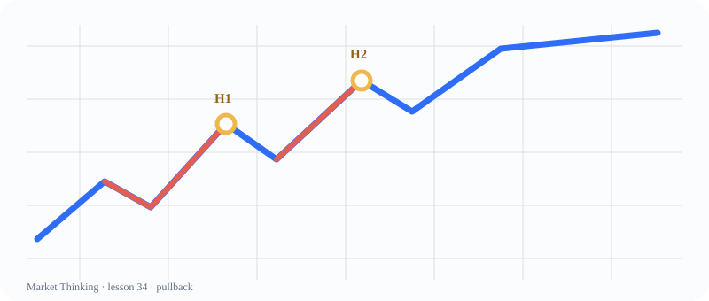

# 第34课：High 1 与 High 2

> 课程位置：第二部分 / Price Action 的核心语言 / 第五单元：回调

## 本课目标
理解 High 1 / High 2 是回调中的尝试次数，不是看到数字就按按钮的公式。

## Price Action 核心
第二次尝试可能更有说服力，也可能只是第二次失败；背景决定它的意义。

> 计数帮助我们观察节奏，但不能代替趋势、区间、位置和风险判断。

## 主图

## 三层案例
### 生活：滑板重新起步
第一次推地没站稳，第二次可能更有节奏；坡度和地面仍决定难度。

### 历史：改革的两次尝试
第二次方案不是天然更好，要看问题是否被修正、阻力是否改变。

### 市场：High 2
多头趋势中的两腿回调后，第二次向上尝试常被观察，但仍需信号和跟进。

## 开放思考题
如果 High 2 出现在很大的区间中部，它和趋势中的 High 2 应该被同样对待吗？

## AI 一起讨论
让 AI 为 High 2 列出“趋势背景”和“区间中部”两份不同解释。

## 复盘卡
- 我看见的事实：
- 我的主要解释：
- 支持证据：
- 反面证据：
- 什么会证明我错：
- 我现在愿意等待的新信息：

## 参考资料
- Al Brooks Trading Price Action Trends
- Al Brooks Trading Price Action Trading Ranges
