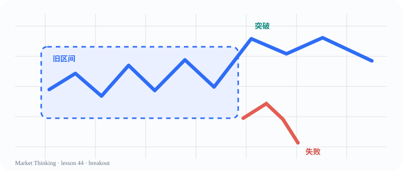
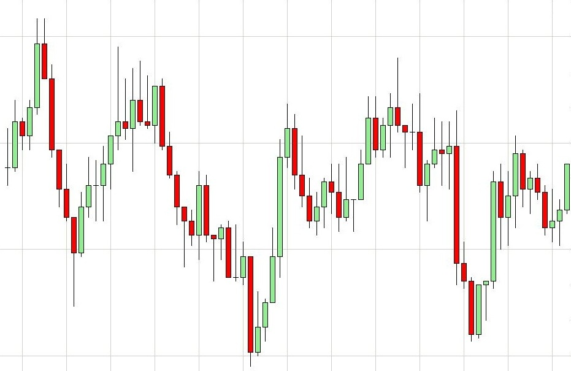

# 第44课：假突破

> 课程位置：第二部分 / Price Action 的核心语言 / 第六单元：突破与失败突破

## 本课目标
观察突破是否被市场接受，并理解假突破为什么会让双方重新评估。

## Price Action 核心
突破是一条假设：价格可能在新区域找到接受；跟进才是后续证据。

> 失败说明某个方向的尝试没有得到足够接受，但不保证反方向一定走很远。

## 主图

## 三层案例
### 生活：教室门口
一个人走出门不代表大家都会离开；后续人流才说明门外是否真的更有吸引力。

### 历史：新路线的试行
政策宣布是突破，执行、反馈和调整才决定它能不能变成新常态。

### 市场：假突破
价格穿越区间边缘后迅速返回，追入者被困；失败后仍需观察新结构。

## 开放思考题
你更愿意在突破刚发生时判断，还是等一根跟进K线？等待会牺牲什么、换来什么？

## AI 一起讨论
让 AI 分别写出“追突破者”“区间交易者”“旁观者”三种视角。

## 复盘卡
- 我看见的事实：
- 我的主要解释：
- 支持证据：
- 反面证据：
- 什么会证明我错：
- 我现在愿意等待的新信息：

## 参考资料
- Wikimedia Commons EUR-USD-trading-range.jpg
- Al Brooks Trading Price Action Trading Ranges
- 许可参考图：`../../assets/reference/eur-usd-trading-range.jpg`，详见 `sources/image-credits.md`。
