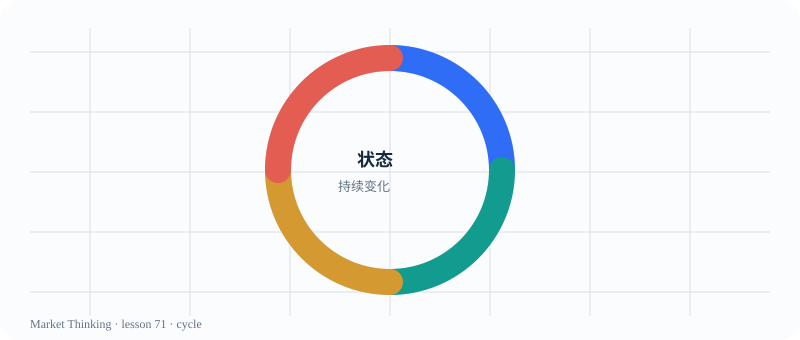

# 第71课：市场状态的循环

> 课程位置：第三部分 / 进阶 Price Action / 第十单元：市场周期

## 本课目标
把突破、趋势、通道、区间看成连续变化的状态，而不是四个互不相干的图形。

## Price Action 核心
推进变慢、重叠变多、双方都能在边缘反应，说明原来的单边优势正在减弱。

> 市场不按章节切换；标签只能帮助我们暂时描述正在发生的变化。

## 主图

## 三层案例
### 生活：一首歌走红
出现、加速、普及、饱和和稳定，是同一个现象在不同阶段的表现。

### 历史：商业周期
新产业先被少数人采用，再进入共识，最后面对竞争和增长放缓。

### 市场：突破 → 趋势 → 区间
状态会转化，必须根据重叠、跟进和结构变化更新判断。

## 开放思考题
你认为“趋势结束”应该发生在哪一刻？还是应该用一组证据描述过渡？

## AI 一起讨论
让 AI 把一张图按周期分成四个阶段，同时指出分界线的不确定性。

## 复盘卡
- 我看见的事实：
- 我的主要解释：
- 支持证据：
- 反面证据：
- 什么会证明我错：
- 我现在愿意等待的新信息：

## 参考资料
- Al Brooks Price Action market cycle framework
- CME Group Trend and Continuation Patterns
