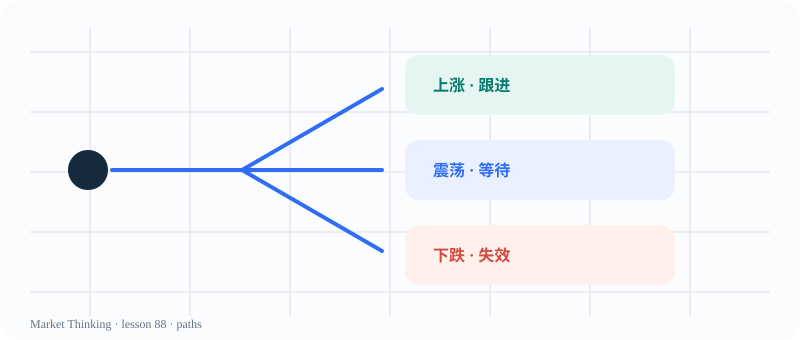

# 第88课：市场没有100%的交易

> 课程位置：第四部分 / 概率、风险与决策 / 第十三单元：概率思维

## 本课目标
把“我觉得会涨”改写成多个可能路径，并明确什么新证据会改变概率。

## Price Action 核心
高概率不是保证；低概率也不是不可能。单次结果无法替方法盖章。

> 概率思维不是把不确定性藏起来，而是把它写出来。

## 主图

## 三层案例
### 生活：带不带伞
天气预报不是确定答案；你会根据下雨概率、出行成本和备用方案做决定。

### 历史：危机前的选择
当时的人只能用有限信息做判断，不能把后来结果当成当时已知事实。

### 市场：三条路径
上涨、下跌、震荡都要先写出来，再比较条件和风险。

## 开放思考题
如果一个判断有60%的可能成立，你会如何描述剩下40%的风险？

## AI 一起讨论
请 AI 生成乐观、中性、悲观三个情景，每个情景都要包含触发条件和失效条件。

## 复盘卡
- 我看见的事实：
- 我的主要解释：
- 支持证据：
- 反面证据：
- 什么会证明我错：
- 我现在愿意等待的新信息：

## 参考资料
- 课程概率与情景树模板
- Al Brooks Price Action probability framing
