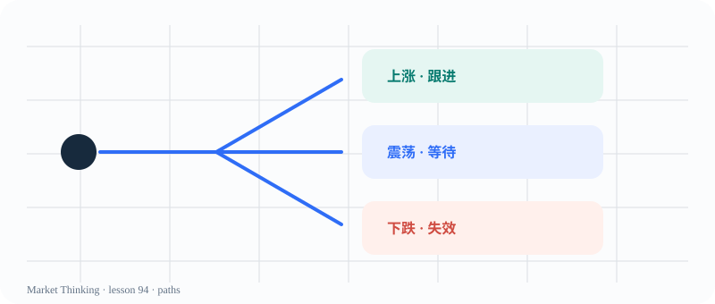

# 第94课：高胜率不一定更好

> 课程位置：第四部分 / 概率、风险与决策 / 第十三单元：概率思维

## 本课目标
围绕《高胜率不一定更好》建立一套可观察、可解释、可更新的判断框架。本课是课程初稿，后续会继续补充案例、图表和教师提示。

## 核心知识
本课属于 decision 主题。学习时先把概念放回上下文：价格在哪里？参与者可能看见什么？什么证据支持当前解释？什么证据会让解释失效？

## 主图

## 三层案例
生活案例：把一个真实选择写成可能路径，注明等待、行动和不行动各自的成本。

历史案例：把当时可获得的信息和事后结果分开，讨论哪些风险当时无法知道。

市场案例：写出支持证据、反面证据、失效条件和最大可接受风险，不用一次结果证明自己。

## 开放思考题
如果没有唯一答案，你会用哪些证据支持你对《高胜率不一定更好》的解释？请同时写出一个反例和一个可能改变观点的新信息。

## AI 一起讨论
请 AI 先复述《高胜率不一定更好》的问题，再提出三个不同情景；要求它标注证据、假设和无法确认的部分。

## 复盘卡
- 我看见的事实：
- 我的解释：
- 支持证据：
- 反面证据：
- 失效条件：
- 下一步观察：

## 参考资料
- Al Brooks Price Action 书籍与视频课程：仅作专业参考，不照搬原书。
- `sources/image-credits.md`：公开图像许可和权威教学页面。
