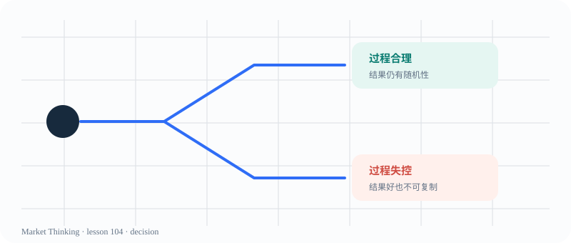

# 第104课：好结果不代表好决策

> 课程位置：第四部分 / 概率、风险与决策 / 第十五单元：决策质量

## 本课目标
把一次决策拆成判断、执行、结果三层，避免用输赢倒推当时是否聪明。

## Price Action 核心
好结果不代表好决策；亏损也不自动证明判断过程错误。

> 一次幸运的结果，可能来自糟糕的过程；一次亏损，也可能来自合理的过程。

## 主图

## 三层案例
### 生活：考前猜题
猜中不代表方法可靠；要回看当时是否有证据和备用计划。

### 历史：战争与偶然
天气、误判和偶然事件共同塑造结果，不能只赞美赢家的故事。

### 市场：好结果 ≠ 好决策
先检查情景、失效条件与风险边界，再看随机性如何影响结果。

## 开放思考题
写一个“结果很好但过程很差”的例子，再写一个“结果不好但过程合理”的例子。

## AI 一起讨论
让 AI 只根据过程评价一次决策，最后再告诉它结果，观察它是否发生结果偏差。

## 复盘卡
- 我看见的事实：
- 我的主要解释：
- 支持证据：
- 反面证据：
- 什么会证明我错：
- 我现在愿意等待的新信息：

## 参考资料
- 课程决策质量复盘表
- Al Brooks Trading psychology discussions
