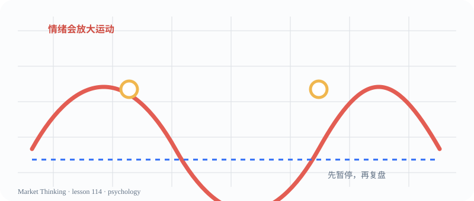

# 第114课：过度自信

> 课程位置：第五部分 / 市场心理与群体行为 / 第十六单元：情绪

## 本课目标
围绕《过度自信》建立一套可观察、可解释、可更新的判断框架。本课是课程初稿，后续会继续补充案例、图表和教师提示。

## 核心知识
本课属于 psychology 主题。学习时先把概念放回上下文：价格在哪里？参与者可能看见什么？什么证据支持当前解释？什么证据会让解释失效？

## 主图

## 三层案例
生活案例：找一个和《过度自信》相似的日常场景，写下供给、需求、等待、竞争或不确定性中的至少两个因素。

历史案例：找一段相关历史事件，区分当时可见证据、后来的解释和仍然无法确定的部分。

市场案例：在一张价格图上标记与本课相关的位置，再写出一个支持解释和一个反面解释。

## 开放思考题
如果没有唯一答案，你会用哪些证据支持你对《过度自信》的解释？请同时写出一个反例和一个可能改变观点的新信息。

## AI 一起讨论
请 AI 先复述《过度自信》的问题，再提出三个不同情景；要求它标注证据、假设和无法确认的部分。

## 复盘卡
- 我看见的事实：
- 我的解释：
- 支持证据：
- 反面证据：
- 失效条件：
- 下一步观察：

## 参考资料
- Al Brooks Price Action 书籍与视频课程：仅作专业参考，不照搬原书。
- `sources/image-credits.md`：公开图像许可和权威教学页面。
