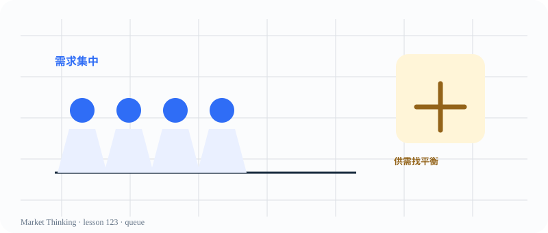

# 第123课：排队与供需

> 课程位置：第六部分 / 从图表迁移到现实世界 / 第十八单元：生活中的市场思维

## 本课目标
从排队、稀缺和等待成本中，发现供需与价格行为的直觉。

## Price Action 核心
当很多人想要同一件稀缺资源，价格之外还会出现等待、筛选和替代。

> 迁移不是把图表术语硬套到生活，而是追问哪些结构相似、哪些条件完全不同。

## 主图

## 三层案例
### 生活：排队买限量鞋
需求集中、供给有限时，等待时间和转售价格都会成为成本。

### 历史：粮食短缺
稀缺会改变选择，但价格不是唯一分配方式，制度也影响结果。

### 市场：价格寻找平衡
买方愿意出更高价格、卖方愿意等待更好价格，成交不断试探新的平衡。

## 开放思考题
如果一个商品排长队，你会把它理解为“值得买”的证据吗？还要问哪些问题？

## AI 一起讨论
让 AI 把排队案例分别解释成供需问题、注意力问题和社会认同问题。

## 复盘卡
- 我看见的事实：
- 我的主要解释：
- 支持证据：
- 反面证据：
- 什么会证明我错：
- 我现在愿意等待的新信息：

## 参考资料
- CME Group Technical Analysis
- 课程迁移案例方法
