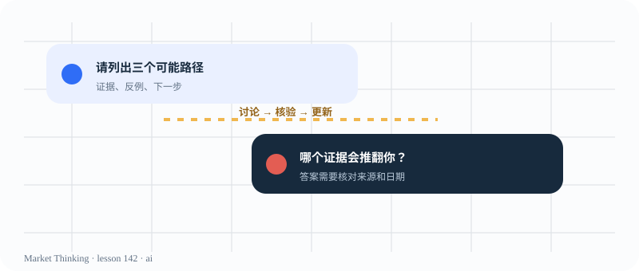

# 第142课：AI不是答案机器

> 课程位置：第七部分 / AI协作与研究方法 / 第二十一单元：如何使用AI

## 本课目标
把 AI 当作会犯错的讨论伙伴：帮助展开情景、反驳观点、整理证据，而不是替你下结论。

## Price Action 核心
AI 的回答越流畅，越需要问：证据在哪里？日期是什么？反例是什么？

> AI 不是答案机器；提问者仍然对判断和核验负责。

## 主图

## 三层案例
### 生活：向同学请教
会表达的人不一定掌握了事实；你仍要核对来源和自己的理解。

### 历史：口述史
同一件事会有多种记忆和视角，记录谁说了什么比快速选一个版本更重要。

### 市场：图表复盘助手
让 AI 先描述事实、列出反方情景，再由人决定如何验证。

## 开放思考题
给 AI 一个“请告诉我会涨还是会跌”的问题，再写一个更好的版本；你改变了哪些限制条件？

## AI 一起讨论
要求 AI 输出：事实清单、主解释、反方解释、缺失数据、需要核对的来源和下一步问题。

## 复盘卡
- 我看见的事实：
- 我的主要解释：
- 支持证据：
- 反面证据：
- 什么会证明我错：
- 我现在愿意等待的新信息：

## 参考资料
- 课程 AI 协作日志模板
- Al Brooks course material as a reference, not an answer source
