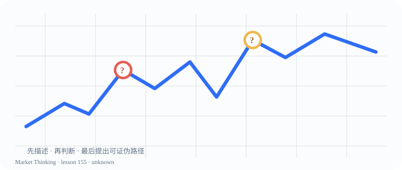

# 第155课：一张陌生图表

> 课程位置：第八部分 / 综合项目 / 第二十三单元：图表推理项目

## 本课目标
不看股票名称、不猜新闻，只用价格行为描述一张陌生图表。

## Price Action 核心
真正的能力不是立刻说对方向，而是能说清楚自己看见了什么。

> 先描述，后判断；允许“不明确”成为严谨答案。

## 主图

## 三层案例
### 生活：陌生城市地图
先辨认道路、边界和人流，再决定去哪；不是先讲一个完整故事。

### 历史：站在当时看事件
隐藏后来发生的事，只使用当时可获得的信息，减少事后偏差。

### 市场：三种可能路径
标状态、找关键位置、列上涨下跌震荡三种路径，并写下失效条件。

## 开放思考题
如果你无法判断趋势或区间，是否可以把“不明确”作为严谨答案？请说明依据。

## AI 一起讨论
先让 AI 把未来走势遮住，只检查它的事实描述，再逐步揭示后续K线。

## 复盘卡
- 我看见的事实：
- 我的主要解释：
- 支持证据：
- 反面证据：
- 什么会证明我错：
- 我现在愿意等待的新信息：

## 参考资料
- 课程截图复盘方法
- Wikimedia Commons technical analysis category
