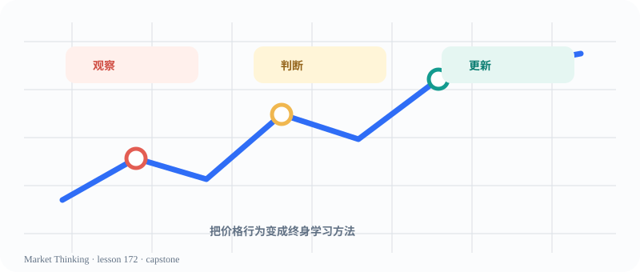

# 第172课：结业项目：解释一段市场

> 课程位置：第九部分 / 结业与长期学习 / 第二十五单元：形成自己的思维系统

## 本课目标
把整套观察框架串成一段可解释、可证伪、能承认不确定性的市场说明。

## Price Action 核心
从事实出发，经过结构与概率，最后回到风险和下一步观察。

> 结业不是获得一张预测证书，而是拥有一套可以继续更新的终身学习系统。

## 主图

## 三层案例
### 生活：做一项重要选择
说明目标、证据、备选方案、最坏情景和什么时候改变计划。

### 历史：解释一段转折
把当时信息、参与者选择、可能路径和后果分开，避免把历史写成必然。

### 市场：交付一张观察卡
状态、结构、位置、证据、概率路径、风险边界，一页说清楚。

## 开放思考题
你的解释中哪一部分最容易被新证据推翻？为什么这反而是优点？

## AI 一起讨论
让 AI 做最终反方审阅，只允许它指出证据缺口、定义不清和未考虑的路径。

## 复盘卡
- 我看见的事实：
- 我的主要解释：
- 支持证据：
- 反面证据：
- 什么会证明我错：
- 我现在愿意等待的新信息：

## 参考资料
- 全部课程框架
- Markdown lesson template
- Al Brooks books and video course as professional references
